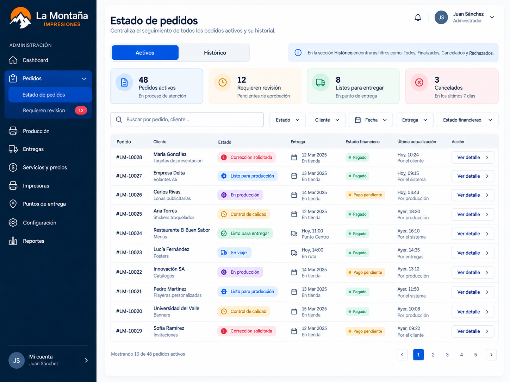
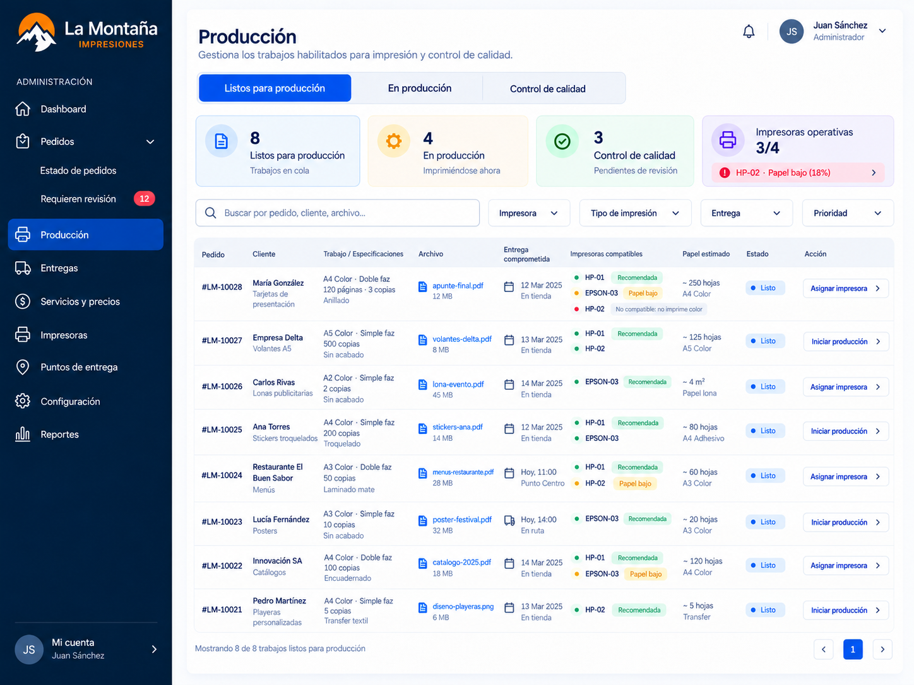
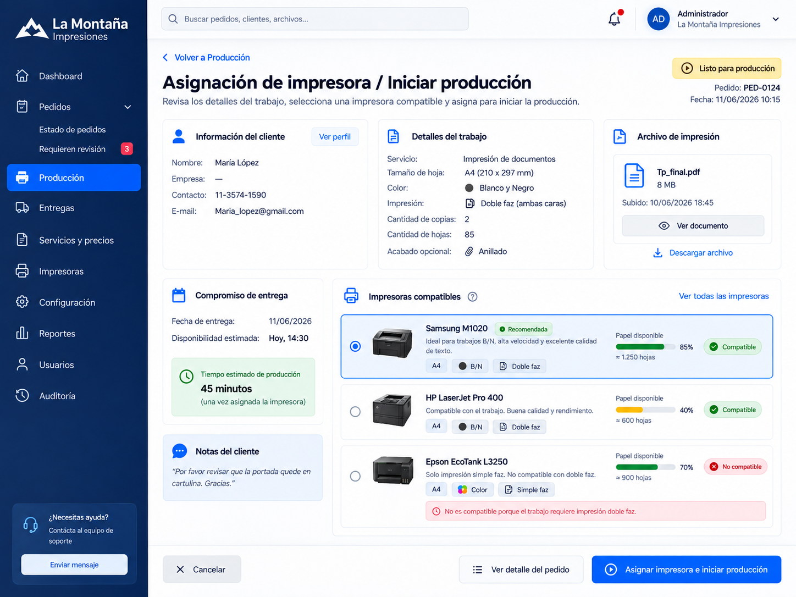
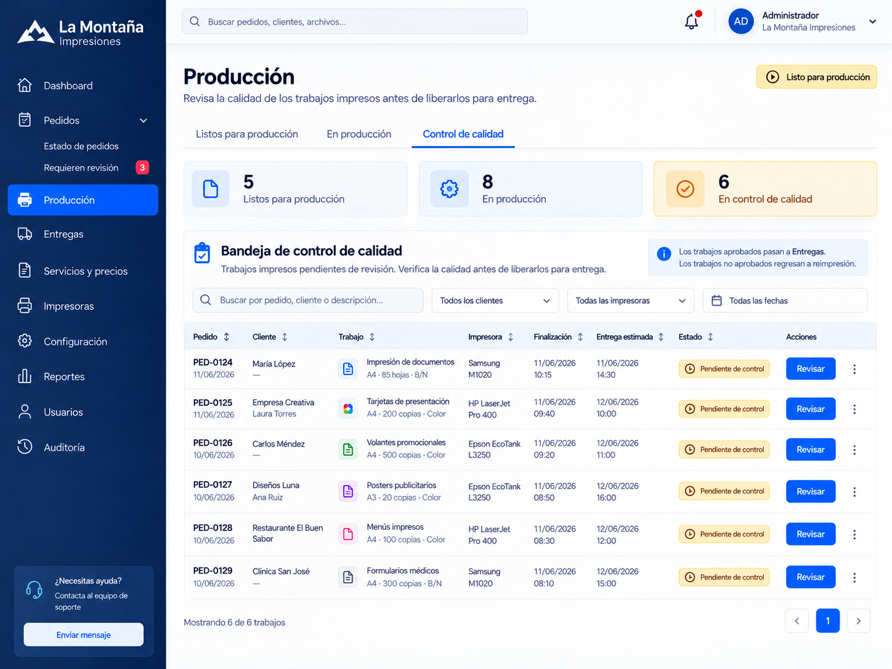
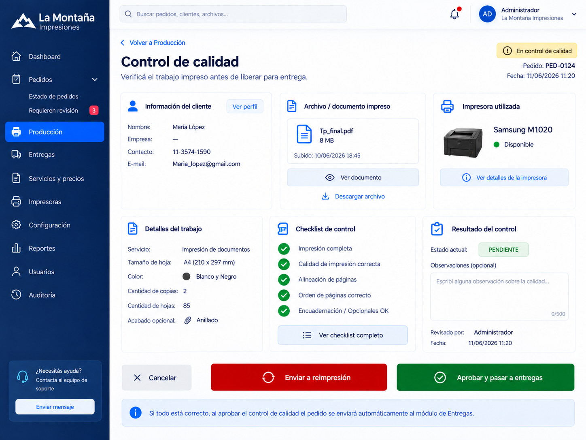
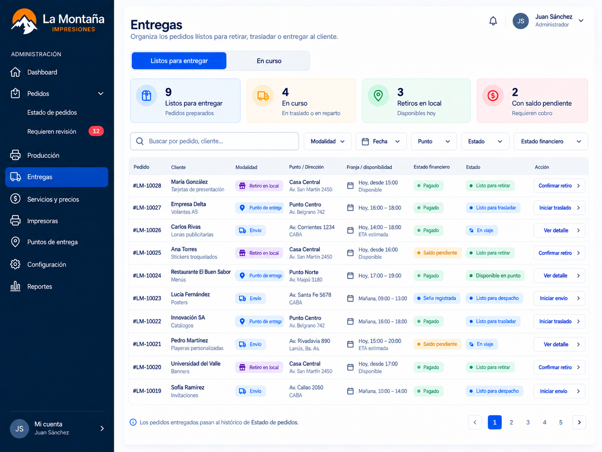

# Operación administrativa

## Propósito

Esta carpeta reúne la evidencia UX/UI vigente de la **operación cotidiana del panel administrativo** de La Montaña una vez incorporado el motor de configuración.

No representa un flujo lineal único ni una repetición del MVP original. El comportamiento visible depende de la configuración activa de la imprenta, mientras que las vistas de esta carpeta representan las superficies operativas utilizadas en el día a día.

La carpeta histórica `flujo de negocio principal` conserva la evidencia del MVP original y no debe utilizarse como referencia vigente para las nuevas vistas administrativas.

## Criterio de organización

Se utilizan prefijos por dominio para evitar colisiones con la numeración del motor de configuración:

- `MC-ADM-PED`: pedidos y seguimiento general;
- `MC-ADM-PRO`: producción y control de calidad;
- `MC-ADM-ENT`: entregas y logística.

## Evidencia visual definida

> Publicados el 18/09/2026: seis PNG originales aprobados, copiados sin edición, conversión ni reconstrucción. E22 [#228](https://github.com/AgusFT/La-Montana/issues/228), milestone M16. Los ejemplos gráficos no sustituyen las reglas ni acreditan implementación.

### Pedidos

- `MC-ADM-PED-001-estado-pedidos.png`
  - bandeja transversal de pedidos;
  - tabs Activos / Histórico;
  - filtros por estado, cliente, fecha, entrega y estado financiero;
  - acceso `Requieren revisión` visible únicamente cuando la configuración activa contempla revisión humana.

### Producción

- `MC-ADM-PRO-001-produccion.png`
  - tabs Listos para producción / En producción / Control de calidad;
  - información del trabajo, compromiso de entrega e impresoras compatibles;
  - acceso a asignación e inicio de producción.

- `MC-ADM-PRO-002-asignacion-impresora-inicio-produccion.png`
  - detalle del cliente y del trabajo;
  - archivo autorizado;
  - impresoras compatibles e incompatibles;
  - recomendación de impresora;
  - disponibilidad estimada de papel;
  - asignación manual e inicio de producción.

- `MC-ADM-PRO-003-control-calidad-bandeja.png`
  - trabajos impresos pendientes de revisión manual;
  - impresora utilizada;
  - hora de finalización y compromiso de entrega;
  - acceso a revisión.

- `MC-ADM-PRO-004-control-calidad-detalle.png`
  - revisión manual del trabajo impreso;
  - checklist de calidad;
  - observaciones;
  - reimpresión ante rechazo;
  - aprobación y derivación a Entregas.

### Entregas

- `MC-ADM-ENT-001-entregas.png`
  - trabajos con control de calidad aprobado;
  - modalidades Retiro en local / Punto de entrega / Envío;
  - estados logísticos y financieros;
  - filtros por modalidad, fecha, punto, estado y estado financiero.

> Estado actual: la bandeja principal de Entregas está definida. Las vistas operativas de detalle, validación y cierre de entrega todavía se encuentran en revisión y se incorporarán cuando queden cerradas.

## Principios funcionales consolidados hasta este punto

- **Pedidos** centraliza el seguimiento general y la consulta histórica. Los estados no se convierten en submenús permanentes.
- **Requieren revisión** depende de la configuración activa del motor, no del contador de pedidos.
- **Producción** comienza cuando un pedido está realmente habilitado para producir y termina cuando supera el control de calidad.
- La asignación de impresora es manual en V1; el sistema puede recomendar una alternativa compatible.
- El control de calidad es una revisión manual. Aprobar deriva el trabajo a Entregas; rechazarlo deriva a reimpresión.
- **Entregas** comienza luego de la aprobación de calidad y adapta su recorrido a la modalidad capturada en el pedido.
- El estado operativo y el estado financiero permanecen separados.
- El timeline del cliente refleja el avance real sin exponer detalles técnicos internos.

## Estado documental

Las incumbencias, acciones y trazabilidad de las seis vistas están documentadas en [WF-OPERACION-ADMINISTRATIVA](../../../wireflows/WF-OPERACION-ADMINISTRATIVA.md). La evidencia está publicada; la validación del equipo y los detalles de Entregas siguen pendientes. La publicación no implica código implementado ni cierre de E06/E07.

## Galería de evidencia aprobada

### MC-ADM-PED-001-estado-pedidos

### MC-ADM-PRO-001-produccion

### MC-ADM-PRO-002-asignacion-impresora-inicio-produccion

### MC-ADM-PRO-003-control-calidad-bandeja

### MC-ADM-PRO-004-control-calidad-detalle

### MC-ADM-ENT-001-entregas

## Integridad de los originales

SHA-256 calculado sobre el PNG original y comprobado después de copiarlo.

| Archivo | SHA-256 |
|---|---|
| `MC-ADM-PED-001-estado-pedidos.png` | `c940a74ea05ace8aac050de24ca76d123141fa190bcb4549339395aca35e6fd8` |
| `MC-ADM-PRO-001-produccion.png` | `8aa0f0c91a046c377b2df390dab64e2483ce6c4e57e4fc1416480fedae8c3e64` |
| `MC-ADM-PRO-002-asignacion-impresora-inicio-produccion.png` | `fb61815ff936686edb49713047aeac8584e119e29c53a649d9cdb16e22b2b6f9` |
| `MC-ADM-PRO-003-control-calidad-bandeja.png` | `a62bf32e93237a9d8c8877c2eee982175af0ba8d633eec451f2eb0eeb7a43328` |
| `MC-ADM-PRO-004-control-calidad-detalle.png` | `9aaf77f76ba6f11f87b1c55e8515c22ccc38c12f6a03840fc6611e8b639cbacb` |
| `MC-ADM-ENT-001-entregas.png` | `32c0eec53d2eef2521f548818693dcf3b70f91f04601e3232b7e607ff70ffcec` |
