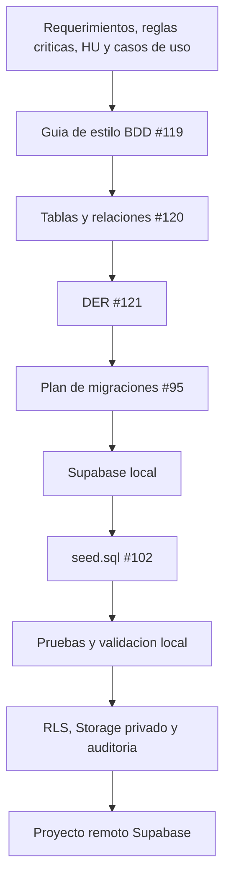

# Flujo de construccion y poblado de la BDD Supabase

| Campo | Valor |
|---|---|
| Version | 1.0 |
| Estado | Inicial |
| Fecha | 2026-06-22 |
| Responsable | Agustin Tejero |

## 1. Objetivo

Este documento define el flujo para pasar desde la documentacion de diseno de
datos hasta la construccion, poblado y validacion local de la base de datos
Supabase/PostgreSQL del MVP de La Montana.

El documento sirve como entrada directa para:

- #95 - migraciones iniciales del esquema MVP;
- #98 - politicas RLS iniciales;
- #102 - seed data y validacion tecnica;
- futuras Edge Functions, RPC y pruebas de backend.

## 2. Criterio principal

La base de datos no debe construirse directamente desde intuicion ni desde el
frontend. El flujo obligatorio es:

1. requerimientos, reglas criticas, historias de usuario y casos de uso;
2. guia de estilo BDD;
3. documento de tablas y relaciones;
4. DER;
5. migraciones Supabase;
6. seeds de desarrollo;
7. validacion local;
8. revision documental y tecnica;
9. aplicacion controlada al proyecto remoto cuando corresponda.

## 3. Repositorios y ramas de trabajo

El diseno documental de datos vive en la rama `main` del repositorio.

Ubicacion documental:

```text
diseño/diseño-de-datos/
```

La implementacion tecnica de Supabase debe realizarse en la rama de backend.

Ubicacion esperada en la rama backend:

```text
desarrollo/backend-supabase/supabase/
```

Archivos y carpetas tecnicas relevantes:

```text
desarrollo/backend-supabase/supabase/config.toml
desarrollo/backend-supabase/supabase/migrations/
desarrollo/backend-supabase/supabase/seed.sql
desarrollo/backend-supabase/supabase/functions/
desarrollo/backend-supabase/supabase/tests/database/
```

Criterio:

- `main` conserva la documentacion aprobada.
- `feat/backend-supabase` implementa migraciones, seeds, RLS, Storage y Edge
  Functions.
- los cambios productivos no se aplican al remoto antes de validar en local.
- las credenciales, tokens y secretos nunca se versionan.

## 4. Artefactos fuente

| Artefacto | Ubicacion | Uso |
|---|---|---|
| Guia de estilo BDD | `diseño/diseño-de-datos/guia-estilo-bdd.md` | Define nombres, PK, FK, auditoria, policies, migraciones y seeds. |
| Modelo de tablas | `diseño/diseño-de-datos/modelo-tablas-relaciones-supabase.md` | Define tablas, campos principales, relaciones, RLS esperada y orden de migracion. |
| DER PlantUML | `diseño/diseño-de-datos/der-modelo-datos-supabase.puml` | Representa entidades, PK, FK y cardinalidades. |
| DER imagen | `diseño/diseño-de-datos/der-modelo-datos-supabase.svg` | Permite revisar visualmente el modelo en GitHub. |
| Config Supabase local | `desarrollo/backend-supabase/supabase/config.toml` | Define comportamiento del stack local. |
| Migraciones | `desarrollo/backend-supabase/supabase/migrations/` | Implementan el esquema definido por la documentacion. |
| Seeds | `desarrollo/backend-supabase/supabase/seed.sql` | Cargan datos minimos reproducibles de desarrollo. |
| Tests de BDD | `desarrollo/backend-supabase/supabase/tests/database/` | Validan estructura, constraints, RLS y datos base. |

## 5. Flujo general



El proyecto remoto solo debe recibir cambios despues de completar la validacion
local y dejar evidencia en commits, issues y Project.

## 6. Paso 1 - Preparar insumos documentales

Antes de crear migraciones deben estar disponibles:

- guia de estilo BDD cerrada;
- documento de tablas y relaciones cerrado;
- DER versionado y revisado;
- decisiones pendientes identificadas;
- issue #95 listo para implementar migraciones;
- issue #102 listo para definir seed data y validacion tecnica.

Si algun punto del modelo no esta claro, se corrige primero la documentacion de
diseno y luego se implementa. No se debe resolver una decision estructural solo
dentro de una migracion.

## 7. Paso 2 - Preparar entorno local Supabase

La implementacion debe hacerse en la rama backend, partiendo del estado remoto
actualizado.

Comprobaciones esperadas:

```text
git switch feat/backend-supabase
git pull --ff-only
```

Luego se valida el stack local:

```text
cd desarrollo/backend-supabase
supabase status
```

Si el stack local no esta iniciado, se inicia siguiendo el README tecnico de la
rama backend.

No se deben versionar:

- `.env` reales;
- `.temp/`;
- tokens;
- claves privadas;
- datos personales reales;
- archivos reales de clientes.

## 8. Paso 3 - Convertir el modelo en migraciones

Las migraciones de #95 deben implementar el modelo definido por
`modelo-tablas-relaciones-supabase.md`.

Orden sugerido:

1. `rol`.
2. `permiso`.
3. `rol_permiso`.
4. `usuario`.
5. `contacto`.
6. `direccion`.
7. `punto_entrega`.
8. `servicio`.
9. `pedido`.
10. `pedido_servicio`.
11. `archivo`.
12. `pago`.
13. `pago_pedido`.
14. `auditoria`.

Criterios de implementacion:

- usar nombres en espanol, singular y `snake_case`;
- usar PK `id_<nombre_de_tabla>`;
- usar FK `id_<tabla_referenciada>`;
- usar `generated always as identity` por defecto para PK internas;
- vincular `usuario.id_usuario_auth` con `auth.users(id)`;
- incluir auditoria base donde corresponda;
- aplicar borrado logico donde sea necesario preservar trazabilidad;
- definir constraints, indices y enums/valores controlados segun la guia;
- mantener `auditoria` como tabla append-only en la practica.

## 9. Paso 4 - Aplicar migraciones en local

Las migraciones deben probarse primero contra Supabase local.

Comando de validacion local esperado:

```text
supabase db reset
```

El reset local debe:

- recrear el esquema desde cero;
- aplicar todas las migraciones en orden;
- cargar `seed.sql` si existe;
- dejar la base lista para validaciones manuales y automatizadas.

Si `supabase db reset` falla:

- no se corrige manualmente la base local;
- se corrige la migracion o seed;
- se repite el reset;
- se documenta el bloqueo si la decision afecta el modelo.

## 10. Paso 5 - Definir y cargar seed.sql

Los seeds de #102 deben ser datos minimos reproducibles de desarrollo y
validacion local.

Seeds esperados:

- roles iniciales: `cliente`, `empleado`, `administrador`;
- permisos iniciales necesarios para pruebas;
- relaciones `rol_permiso`;
- servicios base de ejemplo;
- puntos de entrega activos;
- usuarios de prueba solo si no contienen credenciales reales;
- pedidos, archivos y pagos ficticios cuando sean necesarios para pruebas.

No deben existir en seeds:

- claves privadas;
- tokens;
- contrasenas reales;
- datos personales reales;
- archivos reales;
- claves AES planas;
- payloads binarios;
- rutas locales del cliente;
- informacion sensible innecesaria.

El seed debe permitir probar:

- creacion de usuario de negocio;
- asignacion de rol;
- lectura de catalogos;
- creacion de pedido;
- asociacion de servicios;
- metadata de archivos;
- registro de pagos;
- registro de auditoria.

## 11. Paso 6 - Validar estructura y datos

Validaciones minimas posteriores a `supabase db reset`:

- existen todas las tablas esperadas;
- las PK siguen el formato definido;
- las FK coinciden con el DER;
- las constraints no bloquean seeds validos;
- los indices previstos existen cuando sean necesarios;
- los enums o checks aceptan solo valores controlados;
- la auditoria base existe en tablas persistentes;
- `auditoria` no se trata como tabla editable por usuarios finales;
- `usuario.id_usuario_auth` queda preparado para ownership con `auth.uid()`.

Validacion funcional minima:

1. crear o simular usuario de negocio;
2. asignar rol;
3. leer servicios y puntos de entrega activos;
4. crear pedido de prueba;
5. asociar servicios mediante `pedido_servicio`;
6. asociar metadata de archivo mediante `archivo`;
7. registrar pago y aplicacion mediante `pago` y `pago_pedido`;
8. registrar evento en `auditoria`;
9. confirmar que no se usan datos reales ni secretos.

## 12. Paso 7 - Relacion con RLS

El flujo de migraciones debe dejar el esquema listo para #98.

Tablas con ownership directo o indirecto:

| Tabla | Ownership esperado |
|---|---|
| `usuario` | `id_usuario_auth` y `id_usuario` |
| `contacto` | `id_usuario` |
| `direccion` | `id_usuario` |
| `pedido` | `id_usuario` |
| `archivo` | `id_pedido` e `id_usuario` |
| `pedido_servicio` | `id_pedido` |
| `pago_pedido` | `id_pedido` |

Tablas internas o controladas:

| Tabla | Criterio |
|---|---|
| `rol` | escritura solo administradores/procesos autorizados |
| `permiso` | escritura solo administradores/procesos autorizados |
| `rol_permiso` | escritura solo administradores/procesos autorizados |
| `pago` | gestion interna/financiera |
| `auditoria` | escritura backend/RPC/Edge Function, lectura restringida |

RLS no debe depender del frontend. El frontend puede consumir informacion, pero
las reglas de acceso deben estar en base de datos, RPC o Edge Functions.

## 13. Paso 8 - Relacion con Storage privado

La tabla `archivo` guarda metadata segura del archivo, no el binario original.

Criterios:

- Storage debe ser privado;
- no se usan public URLs;
- Storage guarda ciphertext cuando aplique cifrado del archivo;
- la base guarda `bucket`, `ruta_storage`, `hash_archivo`, `clave_envuelta`,
  `iv` y `version_cifrado` cuando corresponda;
- no se guarda clave AES plana;
- no se guarda archivo original en auditoria;
- no se usan rutas locales del cliente como mecanismo de impresion.

La validacion local debe comprobar que la tabla `archivo` permite vincular
metadata con `pedido` y `usuario` sin exponer archivos de otros clientes.

## 14. Paso 9 - Relacion con auditoria

La tabla `auditoria` debe registrar eventos criticos y errores de forma segura.

Eventos iniciales sugeridos:

- `usuario_creado`;
- `pedido_creado`;
- `pedido_confirmado`;
- `archivo_asociado`;
- `pago_registrado`;
- `estado_pedido_actualizado`;
- `error_edge_function`;
- `acceso_denegado`.

Criterios:

- no guardar archivos;
- no guardar claves;
- no guardar tokens;
- no guardar passwords;
- no guardar payloads completos;
- usar `request_id` para vincular errores, Edge Functions y logs;
- usar `metadata` solo para datos compactos y seguros.

## 15. Paso 10 - Relacion con Edge Functions y RPC

Las migraciones deben permitir que futuras Edge Functions o RPC ejecuten las
operaciones sensibles del flujo.

Operaciones candidatas a backend controlado:

- crear pedido;
- confirmar pedido;
- asociar archivo a pedido;
- registrar pago;
- actualizar estados internos;
- consultar archivos autorizados;
- registrar eventos de auditoria.

Criterio:

- el frontend no debe escribir directamente tablas criticas cuando la operacion
  tenga reglas de negocio, estados, pagos, archivos o auditoria;
- el service role solo debe usarse en backend cuando sea estrictamente
  necesario;
- los errores deben usar un formato compacto y trazable por `request_id`.

## 16. Paso 11 - Validar antes del remoto

Antes de aplicar cambios al proyecto remoto Supabase se debe verificar:

- migraciones aplican en local desde cero;
- seeds son reproducibles;
- no hay secretos en archivos versionados;
- el diff de Git contiene solo archivos esperados;
- el esquema coincide con #120 y #121;
- RLS prevista no queda bloqueada por falta de ownership;
- Storage privado tiene metadata suficiente;
- auditoria no contiene datos sensibles;
- existe commit local con formato #90;
- la issue correspondiente tiene evidencia o queda pendiente hasta el push.

Checklist operativo:

```text
git status -sb
supabase db reset
supabase db diff --schema public
```

El remoto se actualiza solo despues de aprobar la validacion local y definir el
paso de publicacion correspondiente.

## 17. Paso 12 - Aplicacion al proyecto remoto

La aplicacion remota debe ser una accion explicita y revisada.

Antes de aplicar al remoto:

- confirmar que se esta en la rama correcta;
- confirmar que el commit ya fue revisado;
- confirmar que no hay cambios locales ajenos al alcance;
- confirmar que el proyecto Supabase remoto correcto esta vinculado;
- confirmar que no se estan cargando datos reales por seed;
- confirmar que existe plan de recuperacion si la migracion falla.

No se debe aplicar una migracion remota si:

- falla localmente;
- depende de decisiones pendientes no documentadas;
- contiene datos sensibles;
- modifica una tabla fuera del modelo aprobado sin actualizar documentacion;
- rompe compatibilidad con RLS, Storage o Edge Functions.

## 18. Relacion con #95

#95 debe usar este flujo para construir migraciones.

Resultado esperado de #95:

- migraciones reproducibles;
- tablas base creadas;
- PK/FK segun guia;
- auditoria base aplicada;
- constraints e indices iniciales;
- esquema preparado para RLS;
- validacion local documentada.

## 19. Relacion con #102

#102 debe usar este flujo para definir seeds y pruebas tecnicas.

Resultado esperado de #102:

- `seed.sql` con datos ficticios y reproducibles;
- roles, permisos y relaciones iniciales;
- catalogos minimos;
- pruebas o consultas de validacion;
- evidencia de que no hay datos reales ni secretos;
- base local reseteable desde cero.

## 20. Decisiones pendientes antes de implementar

Antes de escribir migraciones o seeds definitivos deben validarse:

- valores definitivos de estados de `pedido`;
- valores definitivos de `estado_financiero`;
- catalogo inicial de permisos;
- servicios reales del MVP o servicios ficticios para demo;
- puntos de entrega reales o ficticios para demo;
- si el comprobante de pago se modela como metadata en `pago` o archivo
  protegido adicional;
- si `punto_entrega` cubre solo retiro en local o tambien entrega a domicilio.

## 21. Criterios de aceptacion del documento

- Existe un documento versionado en `diseño/diseño-de-datos/`.
- El flujo muestra la relacion entre documentacion, modelo, migraciones, seeds
  y validacion.
- El flujo diferencia entorno local y proyecto remoto Supabase.
- El flujo queda alineado con #95 y #102.
- El commit documental debe respetar el criterio de versionado de #90.
